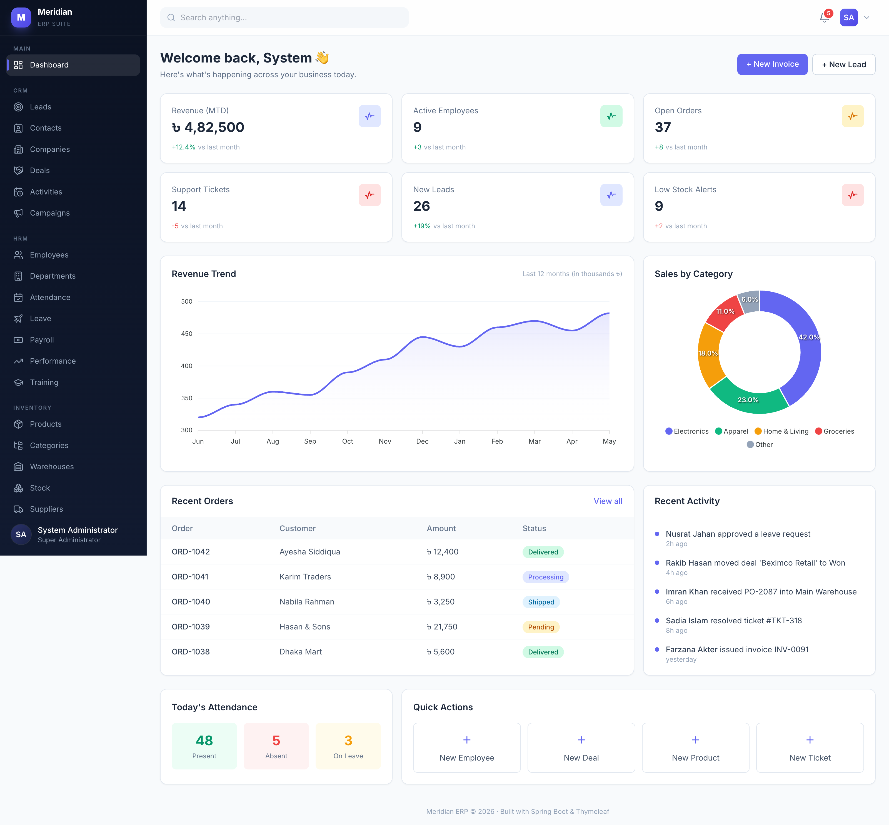
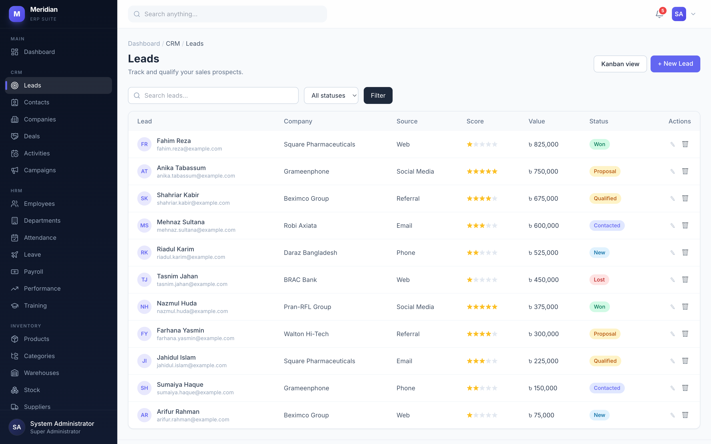
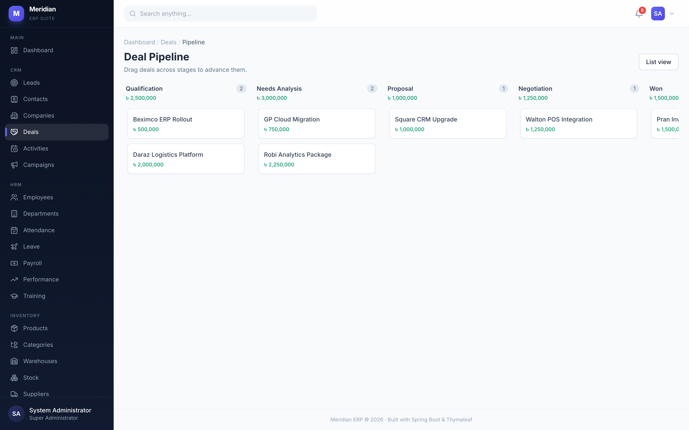
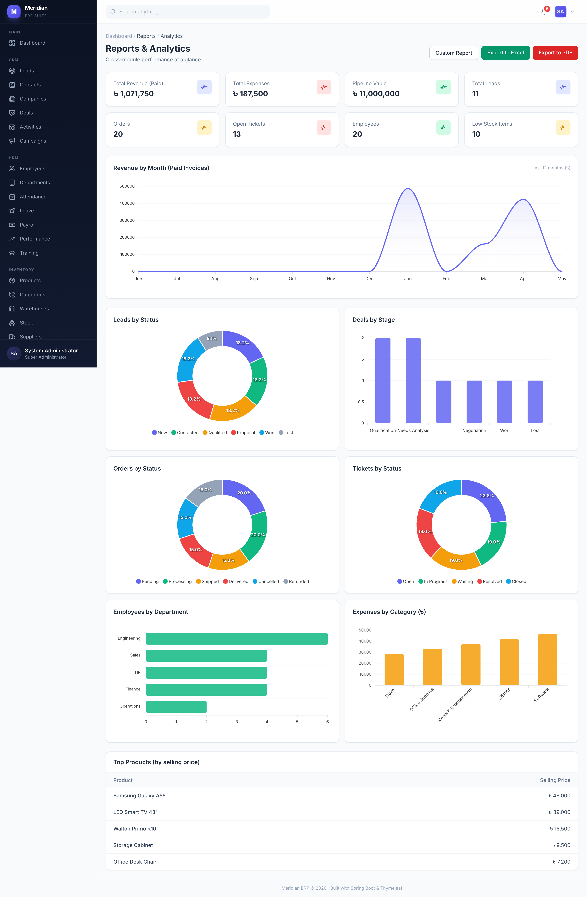
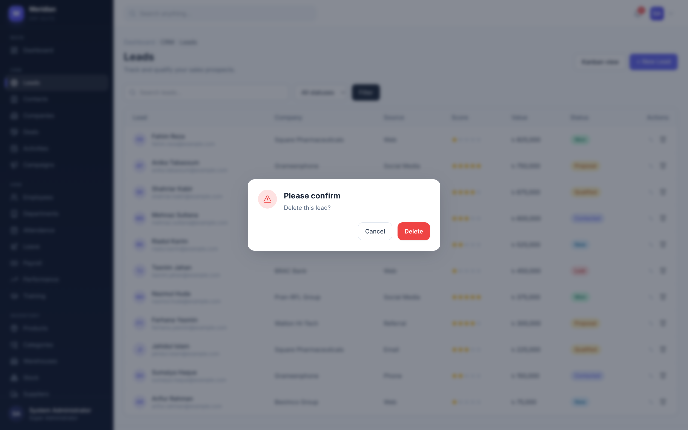

<div align="center">

# 🟣 Meridian ERP

### A modular, open-source Enterprise Resource Planning platform

Run your entire business — **CRM · HR · Inventory · E‑Commerce · Accounting · Procurement · Projects · Support** — from one unified, self-hosted application, plus a public storefront.

<p>
  <a href="https://github.com/msiShariful/meridian-erp/actions/workflows/build.yml"></a>
  <a href="LICENSE"></a>
  
  
  
</p>
<p>
  <a href="https://github.com/msiShariful/meridian-erp/stargazers"></a>
  <a href="https://github.com/msiShariful/meridian-erp/network/members"></a>
  <a href="https://github.com/msiShariful/meridian-erp/issues"></a>
  
  
  
</p>



</div>

---

## ✨ Overview

**Meridian ERP** is a production-grade, full-stack ERP built as a single Spring Boot application using **Spring Modulith** — every business domain is an independent, self-contained module behind one role-aware admin console. It ships with realistic seed data so you can explore every screen the moment it boots, and a public e‑commerce storefront for end customers.

- 🧩 **10 business modules** + dashboard, notifications, audit log and settings
- 🔐 **9 roles** with granular, permission-based access control and method-level security
- 🎨 **Modern UI** — Tailwind CSS, Lucide icons, Alpine.js, ApexCharts, drag‑and‑drop Kanban boards, confirmation modals and toast notifications
- 📦 **Zero external infrastructure** — file-based H2 database, persists across restarts
- 📤 **PDF & Excel export**, printable invoices/payslips/POs, file uploads
- 🌱 **Auto-seeded demo data** with realistic records across every module

## 📸 Screenshots

| Leads (table + scoring) | Deal pipeline (Kanban) |
|---|---|
|  |  |
| **Analytics & reports** | **Confirmation modal** |
|  |  |

## 🗂️ Modules & Features

| Module | What's inside |
|---|---|
| **Dashboard** | Role-aware KPI cards, 12‑month revenue trend, sales-by-category donut, recent orders, activity feed, attendance summary, quick actions |
| **CRM** | Leads (table + drag‑and‑drop Kanban + star scoring + convert‑to‑deal), Contacts, Companies, Deal pipeline with stage totals, Activities, Campaigns with ROI |
| **HRM** | Employees (auto `EMP‑0001` IDs), Departments, Attendance, Leave apply/approve workflow, Payroll + payslips, Performance reviews, Training |
| **Inventory** | Products (auto SKUs, stock-status badges), hierarchical Categories, Warehouses, Stock movements & adjustments, Suppliers |
| **E‑Commerce** | Orders (status workflow + printable invoice), Customers, Coupons, Review moderation, and a **public storefront** (catalog → cart → coupons → checkout → confirmation) |
| **Accounting** | Multi‑line Invoices (tax/discount, printable, payments), Payments, Expense approval workflow, balanced Journal entries, Chart of Accounts, Budgets with variance |
| **Procurement** | Vendors (scorecards), Requisitions (approval workflow), Purchase Orders (multi‑line, printable, goods receipt), GRN, Vendor bills |
| **Projects** | Projects (progress + CSS Gantt), Tasks (drag‑and‑drop Kanban + list), Milestones, Comments, Timesheets |
| **Support** | Tickets (email‑style threads, SLA breach detection), Knowledge Base with helpful voting, FAQ |
| **Reports** | Cross-module analytics dashboard, custom report builder, **Excel (Apache POI) & PDF (OpenPDF) export** |
| **Settings** | Company profile, User management, Role permission matrix, Email (SMTP) config, System info, Backup |
| **Platform** | In-app notifications, AOP audit logging, global exception handling, custom error pages, file uploads |

## 🧱 Tech Stack

| Layer | Technology |
|---|---|
| Language / Runtime | **Java 21** |
| Framework | Spring Boot 3.4 · **Spring Modulith 1.3** |
| Web / View | Spring MVC · Thymeleaf 3 + Layout Dialect |
| UI | Tailwind CSS · Alpine.js · Lucide icons · ApexCharts (CDN) |
| Security | Spring Security 6 (form login, BCrypt, role + permission, `@PreAuthorize`) |
| Persistence | Spring Data JPA / Hibernate · **H2 (file-based)** |
| Build | Maven |
| Export | Apache POI (Excel) · OpenPDF (PDF) |
| Utilities | Lombok · MapStruct · ModelMapper · Bean Validation |
| Testing | JUnit 5 · Spring Security Test · MockMvc |

---

## 🚀 Getting Started

### Prerequisites

- **JDK 21** (LTS) — [Temurin](https://adoptium.net/temurin/releases/?version=21) recommended
- **Maven 3.9+** (or use the bundled wrapper)

> 💡 The project targets Java 21. If your machine defaults to a newer JDK, point `JAVA_HOME` at a 21 install before building.

### 1. Clone the repository

```bash
git clone https://github.com/msiShariful/meridian-erp.git
cd meridian-erp
```

### 2. Run it (Maven)

```bash
mvn spring-boot:run
```

Open **<http://localhost:8080>** and sign in (see [demo accounts](#-demo-accounts)). That's it — the H2 database is created at `./data/erpdb` and seeded with demo data on first launch.

### 3. …or run it with Docker

```bash
docker build -t meridian-erp .
docker run -p 8080:8080 -v "$(pwd)/data:/app/data" meridian-erp
```

### 4. …or build and run a jar

```bash
mvn clean package
java -jar target/meridian-erp.jar
```

---

## 🔐 Demo Accounts

Every demo account uses the password **`Admin@1234`**.

| Email | Role | Sees |
|---|---|---|
| `admin@erp.com` | Super Administrator | Everything |
| `tanvir.admin@erp.com` | Administrator | All modules + most settings |
| `nusrat.hr@erp.com` | HR Manager | HRM + reports |
| `rakib.sales@erp.com` | Sales Manager | CRM + e‑commerce |
| `farzana.acc@erp.com` | Accountant | Accounting |
| `imran.inv@erp.com` | Inventory Manager | Inventory + procurement |
| `sadia.support@erp.com` | Support Agent | Support desk |
| `mehedi.emp@erp.com` | Employee | Dashboard + projects |

Each role only sees the modules its permissions allow — sign in as different users to see the navigation and access change.

## 🧭 Usage

- **Admin console** — `http://localhost:8080/dashboard`
- **Public storefront** — `http://localhost:8080/shop` (no login required: browse → add to cart → apply coupon → checkout)
- **H2 database console** — `http://localhost:8080/h2-console` (JDBC URL `jdbc:h2:file:./data/erpdb`, user `sa`, empty password)

A few things worth trying:

- Drag leads across the **CRM pipeline** (`/crm/leads/kanban`) or tasks across the **project board** (`/projects/tasks`)
- Create an **invoice** with line items, record a payment, then print it
- Export an **Excel/PDF report** from `/reports`
- Manage users and the **role permission matrix** under `/settings`

## ⚙️ Configuration

Key settings live in `src/main/resources/application.properties`:

| Property | Default | Description |
|---|---|---|
| `server.port` | `8080` | HTTP port |
| `spring.datasource.url` | `jdbc:h2:file:./data/erpdb;AUTO_SERVER=TRUE` | H2 file database (persistent) |
| `spring.jpa.hibernate.ddl-auto` | `update` | Schema managed by Hibernate |
| `erp.upload.dir` | `uploads` | Where uploaded files are stored |
| `erp.mail.enabled` | `false` | Mail uses a mock transport by default |

To reset all data, stop the app and delete the `./data` directory — it will be recreated and reseeded on the next start.

## 🧪 Testing

```bash
mvn test
```

The suite boots the full Spring context against an isolated in-memory database and verifies security seeding, public/authenticated routing and access control.

## 📁 Project Structure

```
src/main/java/com/erp/
├── config/         # Security, MVC, auditing, global model advice
├── common/         # BaseEntity, enums, exceptions, file storage
├── core/           # User, Role, Permission, auth, profile
├── dashboard/      # Aggregated KPI dashboard
├── crm/ hrm/ inventory/ ecommerce/ accounting/
├── procurement/ projects/ support/        # business modules
├── reports/        # cross-module analytics + export
├── notifications/  audit/  settings/       # platform features
src/main/resources/
├── templates/      # Thymeleaf views (layout, per-module, shop, errors)
└── static/         # app.css, app.js
```

Each module is a self-contained vertical slice (`entity → repository → service → controller → templates`) with an idempotent demo-data seeder.

## 🗺️ Roadmap

- [ ] REST API + OpenAPI docs
- [ ] Pluggable database (PostgreSQL/MySQL profiles)
- [ ] Real SMTP delivery & email templates
- [ ] Recurring invoices and scheduled report generation
- [ ] i18n / multi-currency at the data layer

## 🔒 Security Note

This is a reference/demo application: it ships with seeded demo credentials, an enabled H2 console and a mock mail transport. **Change the default accounts, disable the H2 console and configure real SMTP before any production use.**

## 🤝 Contributing

Contributions are welcome! Please read [CONTRIBUTING.md](CONTRIBUTING.md) for setup, conventions and the PR process.

## 📄 License

Released under the [MIT License](LICENSE) — free to use, modify and distribute.

## 👤 Author

Built by **[Shariful Islam (@msiShariful)](https://github.com/msiShariful)**.

If Meridian ERP is useful to you, please consider giving it a ⭐ — it helps others discover the project.
